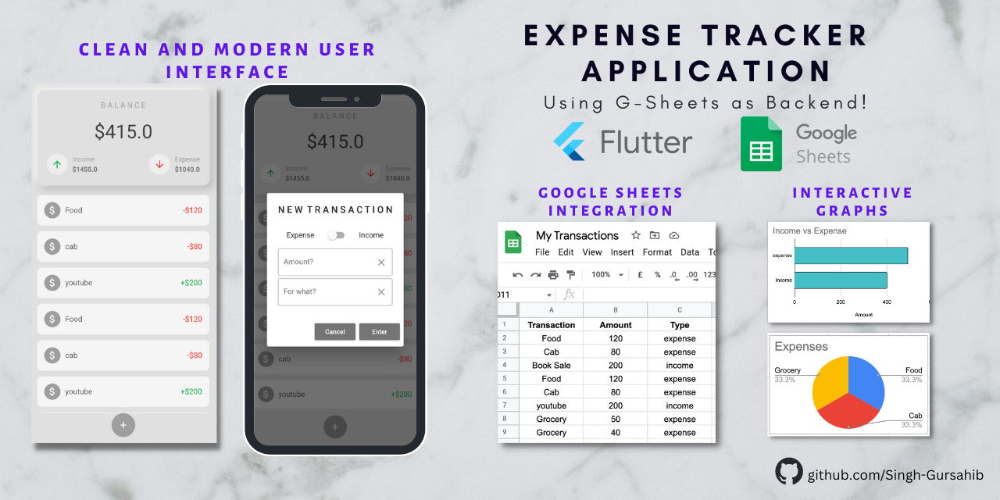

# Expense Tracker App

Take control of your finances with my new expense tracker app built on Flutter! 💰💻 Say goodbye to cluttered receipts and manual tracking with our integration with Google Sheets. 📊 Get a visual insight into your spending patterns with beautiful and interactive graphs, and personalize the app with stunning UI/UX skins. 🎨 Access your expenses on-the-go with g-sheet's multi-platform support, and stay updated in real-time. 📱 Make managing your finances an effortless and enjoyable experience with user-friendly design. 💻

## Features

- Easy expense tracking
- Integration with Google Sheets
- Visual insight with interactive graphs
- Customizable UI/UX skins
- Multi-platform support
