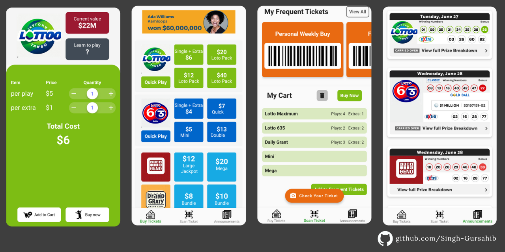

# ChronoCraft: Crafting Time with Precision 🕰️

Step into the future of AI-driven shift scheduling with ChronoCraft, a conceptual showcase of my vision for effortless workplace management. 🌐📱 Witness dynamic shift planning, interactive AI communication, and a streamlined user interface. This concept epitomizes my aspiration to intertwine innovation and utility flawlessly. 🎓

## Features

- **Profile Customization**: Toggle effortlessly between `Admin` and `Employee` roles for a personalized user journey.
- **AI-powered Chat Assistant**: Dive into real-time scheduling queries and receive instant answers from our responsive chatbot.
- **Intuitive Calendar Display**: Grasp the entire biweekly shift landscape at a single glance, all organized and detailed.
- **Adaptive Scheduling System**: Featuring real-time notifications, automatic adjustments, and an underlying AI-driven mechanism that ensures fairness and efficiency.
---
# Lottery App

Dive into the world of lotteries with this app, a testament to my exploration and growth in Flutter. 🌈📱 Experience dynamic ticket customization, innovative barcode tech, and a lively user interface. This project reflects my ongoing commitment to merging design and functionality seamlessly. 🎓

## Features

- **Real-time Ticket Personalization**: Experience the ease of on-the-spot ticket adjustments.
- **Barcode Decoding**: Innovative multi-game ticketing through precise barcode insights.
- **Engaging Design**: A blend of colours and animations creating an inviting user environment.
- **Built with Flutter**: Emphasizing its cross-platform capabilities.

---
# Dynamic Math Website

    
    

Introducing a website designed to simplify complex math and boost problem-solving skills. This platform is a testament to my dedication to making mathematics more accessible and user-friendly. 🚀

## Features

- **Simplify Complex Math**: Seamless operations like matrix addition, subtraction, and multiplication.
- **Quadratic Equation Solver**: Effortlessly find roots for any quadratic equation.
- **Advanced Features**: Sign up to unlock a richer mathematical experience.
- **Responsive Design**: Optimized for tablets, mobile devices, and laptops.
- **Eye-Catching UI/UX**: A blend of aesthetics and functionality for a delightful user experience.
- **Robust Tech Stack**: Built on a foundation of HTML, CSS, and JavaScript for smooth and reliable performance.

[Explore the Website](https://singh-gursahib.github.io/index.html)

Dive into the world of math with me and discover its endless possibilities! 💡✨

---
# Expense Tracker App

Take control of your finances with my new expense tracker app built on Flutter! 💰💻 Say goodbye to cluttered receipts and manual tracking with our integration with Google Sheets. 📊 Get a visual insight into your spending patterns with beautiful and interactive graphs, and personalize the app with stunning UI/UX skins. 🎨 Access your expenses on-the-go with g-sheet's multi-platform support, and stay updated in real-time. 📱 Make managing your finances an effortless and enjoyable experience with user-friendly design. 💻

## Features

- Easy expense tracking
- Integration with Google Sheets
- Visual insight with interactive graphs
- Customizable UI/UX skins
- Multi-platform support

---
# Tic-Tac-Toe Game

I wanted to share my first Flutter application: Tic-Tac-Toe!!

Created in 2021, this game has a welcome screen, scoreboard, and fun-to-use UI. Coded with the Flutter framework in Dart. I highly recommend the Flutter framework for its ease of use and production workflow. It's a great place to begin the journey of cross-platform application development. 😇

## Features

- Welcome screen
- Scoreboard
- Fun-to-use UI

